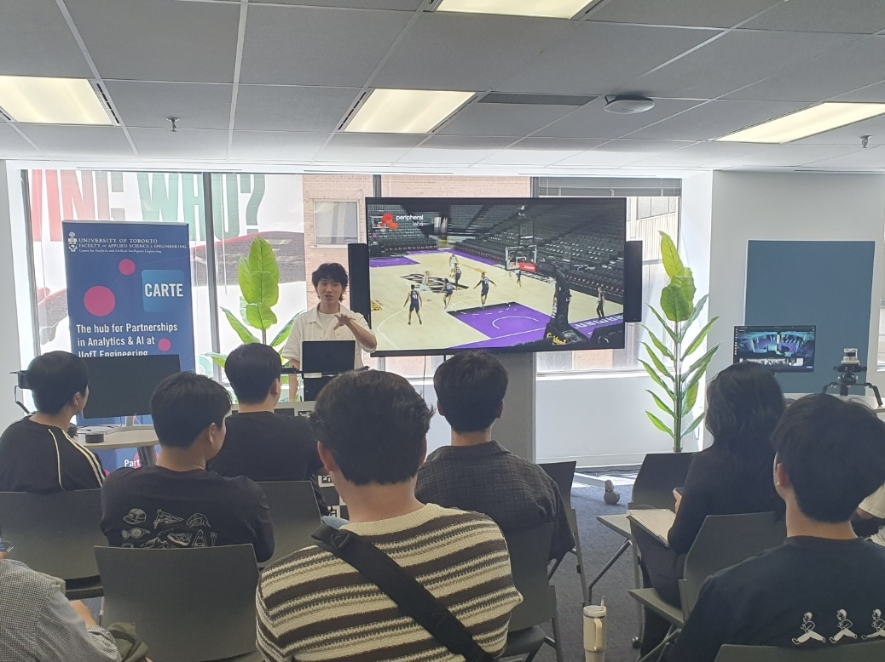
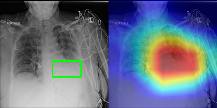
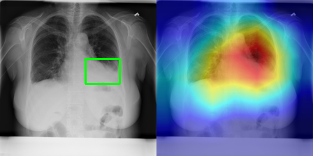
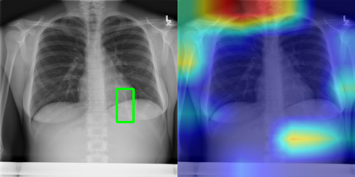
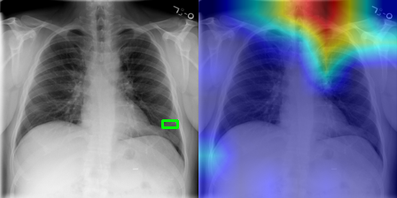
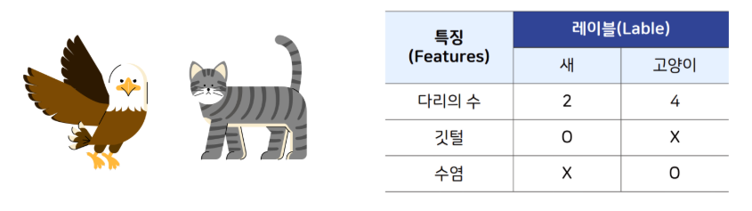
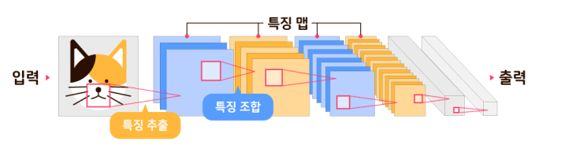
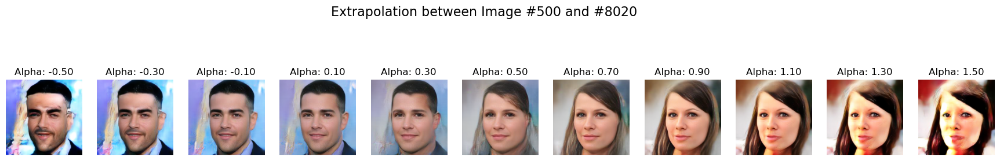

# **여명구 | 인공지능 연구원 포트폴리오**
### AI Researcher & Developer Portfolio

* **Email:** `brightmgu@gmail.com`
* **GitHub:** `https://github.com/brighteen`
* **학과:** `인공지능학과 (202192122)`

---

## **1. About Me (소개)**

AI 기술을 통해 현실의 문제를 정의하고 해결하는 데 깊은 흥미를 느끼는 예비 연구원입니다. 특히 **데이터가 부족한 현실적 제약을 극복하는 효율적인 AI 모델링**에 관심이 많습니다. 캐나다 토론토 대학에서의 글로벌 경험을 통해 이론과 산업 현장의 간극을 줄이는 것의 중요성을 깨달았고, 이후 의료 영상 분석 프로젝트를 수행하며 실제 데이터가 가진 한계를 직접 마주했습니다.

이 경험은 저를 'AI가 스스로 고품질의 학습 데이터를 생성하여 성능을 높이는' 독창적인 연구로 이끌었습니다. 주어진 문제를 해결하는 것을 넘어, 세상에 없는 질문을 던지고 창의적인 해결책을 통해 기여하는 연구자로 성장하는 것이 저의 목표입니다.

## **2. Education & Awards (학력 및 수상)**

* **전주대학교** | 인공지능학과 학부생 *(2021.03 ~ 현재)*
* **국가우수장학생 (이공계)** | 한국장학재단 *(2025.03 ~ 2027.02)*
    * 전공 분야에 대한 학업 성실성과 연구 잠재력을 인정받아 2년간 전액 장학생으로 선발되었습니다.

---

## **3. Global Experience (글로벌 경험)**

### **캐나다 토론토 대학교 | AI 글로벌 워크숍**
*기간: 2025년 7월 (2주)*

전공 지식이 실제 산업 현장에서 어떻게 활용되는지 직접 확인하고자 워크숍에 참여했습니다. 최신 AI 이론 학습과 더불어, 가장 큰 영감을 준 것은 현지 AI 기업 방문이었습니다. 수십 대의 카메라가 운동선수의 움직임을 실시간 3D 데이터로 재구성하는 기술을 보며, 이론이 어떻게 상업적 가치로 연결되는지 생생하게 체험할 수 있었습니다. 이 경험은 ‘진짜 문제를 해결하는 기술’에 대한 저의 열망을 구체화하는 결정적인 계기가 되었습니다.

> `[사진 2: 캐나다 토론토대학교 활동사진, 수료증]`
>

> **사진 설명:** 워크숍 기간 중 토론토 대학교에서 동기들과 함께한 모습 및 프로그램 수료증.

> `[사진 3: 캐나다에서 방문한 현지 AI기업.(스포츠 동영상 3D로 탐지, 분할)]`
>  
> **사진 설명:** 현지 AI 기업에서 실시간 3D 모션 캡처 기술 시연을 보며 깊은 인상을 받았습니다. 이 방문은 제 연구 관심사를 구체화하는 데 큰 영향을 주었습니다.

---

## **4. Projects (주요 프로젝트)**

### **Project 1: 흉부 X-ray 이미지를 활용한 의료 영상 분석**

* **개요:** 의료진의 진단을 보조하기 위해, 흉부 X-ray 이미지에서 주요 질병 소견을 자동으로 탐지하는 AI 모델을 개발했습니다. 대량의 의료 영상을 빠르고 일관되게 분석하여 진단의 효율성을 높이는 것을 목표로 했습니다.
* **도전 과제:** 실제 의료 데이터는 특정 질병 데이터만 많고 희귀 질병 데이터는 턱없이 부족한 **'데이터 불균형(Data Imbalance)'** 문제가 심각했습니다. 이로 인해 AI 모델이 소수 클래스의 질병을 제대로 학습하지 못하고, 다수 클래스로만 예측을 내놓는 명백한 성능 한계를 보였습니다.
* **결과 및 배운 점:** 이 프로젝트를 통해 AI 모델의 성능은 결국 양질의 데이터에 달려있다는 근본적인 문제를 직접 마주했습니다. 기술적 한계를 명확히 인식한 이 경험은, 다음 핵심 연구인 **'데이터 생성 기반의 성능 향상 연구'로 나아가는 결정적인 동기**가 되었습니다.

> `[사진 4: 현재 진행하고 있는 흉부 질병탐지 실험 사진(불균형 클래스 데이터이기 때문에 좋지 않은 결과)]`
>

  
> **사진 설명:** 데이터 불균형 문제로 인해 특정 질병(붉은색)을 거의 예측하지 못하고 다수 질병(푸른색)으로만 편향되어 나타난 초기 실험 결과(Confusion Matrix). 이 실패는 새로운 연구의 필요성을 절감하게 했습니다.

### **Project 2 (Core Research): AI의 자기 개선을 통한 생성 모델 성능 향상**

#### **연구 배경: "AI가 스스로 학습 데이터를 만들게 할 수 없을까?"**
앞선 프로젝트에서 겪은 데이터 부족 문제를 해결하기 위해, "만약 AI가 가진 데이터와 유사하지만 다른, 새로운 데이터를 스스로 만들 수 있다면 어떨까?" 라는 질문에서 이 연구를 시작했습니다. AI가 스스로 양질의 학습 자료를 만들어내게 하는 **'자기 개선(Self-improving)' 프레임워크**를 제안하고 검증했습니다.

> `[사진 5: 인공지능이 이미지를 어떻게 학습하는지를 보여주는 사진]`
>
  
> **사진 설명:** 인공지능이 수많은 이미지의 핵심 특징(눈, 코, 입 등)을 학습하여 자신만의 '개념'을 만들어가는 과정을 시각화한 자료. 이 원리를 응용하여 연구를 시작했습니다.

#### **핵심 아이디어 및 과정: 2단계 접근법**
1.  **(아이디어 스케치 생성)** AI가 이미 학습한 얼굴 사진들의 특징(눈 모양, 코의 높이 등)을 미세하게 조합하여, 세상에 없던 **수만 개의 새로운 얼굴 스케치(후보 데이터)**를 그리도록 했습니다.
2.  **(우수 스케치 선별)** 이후, '이 얼굴이 실제 사람과 얼마나 비슷한가?'를 **정량적인 점수로 계산하는 저만의 평가 기준**을 개발했습니다. 이 기준으로 높은 점수를 받은, 즉 가장 자연스럽고 품질 좋은 상위 10,000개의 스케치만 자동으로 추려냈습니다.

> `[사진 6: 사람 얼굴 이미지셋을 활용해 새로운 사람의 이미지를 만들수 있을까에 대한 실험 사진들.]`
>
  
> **사진 설명:** 연구 초기, AI가 생성한 수만 개의 '아이디어 스케치'. 평가 기준을 적용하기 전이라 대부분의 결과물이 어색하거나 비현실적인 모습을 보입니다.

> `[사진 7: 위 실험 중 새로운 얼굴들이 보임.]`
>
> **사진 설명:** 자체 개발한 평가 기준으로 '좋은 스케치'만 선별한 결과. 이전과 달리, 실제 사람처럼 자연스러운 고품질의 이미지만 남은 것을 통해 제안한 방법론의 효과를 확인할 수 있었습니다.

#### **결과 및 의의**
제가 제안한 방법으로 추가 데이터를 생성하고 이를 학습에 활용한 AI는, 이전보다 훨씬 더 자연스럽고 다양한 결과물을 만들어냈습니다. 이 연구를 통해, **주어진 문제를 푸는 학생에서 세상에 없는 문제를 정의하고 해결책을 찾아 나서는 연구자로 성장**할 수 있었습니다. 현재 이 연구 결과를 바탕으로 학술 논문을 준비하고 있습니다.

---

## **5. Skills (보유 기술)**

* **Programming Languages:** Python, SQL(Basic)
* **AI / ML Frameworks:** PyTorch, Scikit-learn
* **Libraries:** NumPy, Pandas, Matplotlib, OpenCV
* **Tools:** Git, GitHub, VSCode